[TOC]

# 1.课程背景

## 1.1作者及课程简介

- 关于作者

> ​	作者本科专业是工商管理，研究生专业是金融，本科及研究生都不是计算机类专业，但是目前已在计算机行业从业了5年。
>
> ​	作为非科班程序员，作者深知在学习计算机技术过程中的难点，因此在不断学习积累的过程中，非常期待能够做一些综合类的项目，一方面对自己整个的知识体系进行查缺补漏，另一方面可以接触到生产上项目的开发流程，积累项目经验。
>
> ​	作者经常在B站上学习，对于一些技术的入门，比如Python语言学习，直接查找对应类目下的播放量最高的视频课学习就好了，对于课程开源这一点，应该说各大培训机构还是比较良心的（虽然可能是内卷造成的），这几乎可以代表某项技术入门教程的行业最高水平了，而如果你去购买一些小众的不知名的付费基础课程，听完对比后，大概率会发现课程效果不如B站的开源课程，所以有时候也不得不感叹，免费的东西往往才是最珍贵的。
>
> ​	而如果你想要更近一步，想要学习一些综合性更高的项目，从而学习到生产上的开发流程，并补充到自己的项目经历中，这类基础课程中提供的项目就显得非常局限了，因为这类项目都是老师经过抽象抽象再抽象、简化简化再简化后，才提炼出来放到课程中，基本上都不是一个完整的项目，尤其在项目对应的业务逻辑方面，短板尤为明显，这就导致，如果你将该项目吸收消化后放到自己的简历里面，在面试时其实是非常经不起推敲的，面试官让你阐述业务逻辑，你也没办法讲得很清楚，有很多项目经历其实一眼就可以看出来是否真实，因而在简历筛选阶段或技术面阶段，简历中有这种包装项目的，大概率是过不了的。

- 课程简介

> ​	这门课程来源于作者曾经做过的一个真实项目，作者在保留原始业务场景及需求不变的条件下，重构了该项目，将server端的服务改为更通用的Flask服务，对计算逻辑进行了简化，更易于理解，另外对前端的页面展示进行了优化，交互可视化效果更出色。
>
> ​	概括来说，这门课程有如下特色：
>
> 1）这是一个全栈的数据挖掘项目（业务背景是针对游戏项目的盈亏预估），一个可在生产直接使用的内网项目（补充登录逻辑后，可对外服务）；
>
> 2）课程有清晰充实的文档，有逻辑清晰的代码及配套视频，可以跟着老师从0到1搭建完成该项目；
>
> 3）项目的业务逻辑阐述的非常清楚，可以轻松的补充至简历的项目经历中；
>
> 4）老师提供全程的答疑服务，可手把手协助先让项目在你的电脑上运行起来；
>
> 5）这是自动化办公中关于数据处理的一个高级示例，通关后，对于所有类似的可抽象出来的数据处理场景，均可轻松拿下；
>
> ​	技术栈：
>
> 1）语言：
>
> 后端：Python，前端：html，css，js
>
> 2）框架及核心依赖：
>
> 后端：Flask、numpy、pandas，前端：jQuery、echarts、jspreadsheet
>
> 3）生产服务器：
>
> 后端：Supervisor+Gunicorn，前端：Nginx

## 1.2面向人群

- 在职程序员

> ​	如果你现在正在从事某一个方向的工作，比如：前端开发、后端开发、数据分析、数据挖掘等，想往全栈方向上努力，那么这个项目绝对是走向全栈的一个良好的起点项目，你可以利用你自身的优势，对该项目你比较擅长的部分进行进一步优化，使其内化为你自己的项目。
>
> ​	当然，如果你仅是想扩充自己的项目经历，这个项目也是一个比较好的选择，因为它本身就来自于真实的生产项目，业务背景介绍的非常充分。

- 非程序员群体

> ​	如果你是一个业务人员，比如：运营、产品、财务等，如果你的工作中经常涉及到数据处理，并且你对自动化办公有比较强烈的兴趣，那么你把这个项目通关后，前路将一片光明。
>
> ​	对于非程序员群体，做这种项目，当然需要一定的基础，但是就我所知，目前大部分工作中经常处理数据的人员都已经在学习用Python处理数据了，一方面是最近几年Python比较火，相关的推广课程非常的多，即使不是程序员，也有大部分人在主动学习，比如作者的前公司，整个财经部门很早就开始推广使用Python作日常的数据处理了，所以在有一定基础的条件下，学习本课程难度会下降很多，对于课程中不懂的知识点，对应补充即可。
>
> ​	如果你是一个纯小白，那么你需要先花一定的时间补充一下基础知识，不过也不需要过于担心，无论学习什么，兴趣和努力是最重要的变量，先天的基础并不能最终决定你的段位。

- 计算机专业应届生及在校生

> ​	如果你是一名应届生或者在校生，希望充实自己的简历，优化项目经历，这个项目绝对是不二之选。因为本项目更多的是关注业务、关注解决问题本身，而不是首先关注技术，换句话说，生产上是业务决定了你用什么技术，而不是你先有了什么技术后，才能开始什么业务，对于业务的理解能力，是决定你最终是否能够将项目做成功的重中之重。

- 游戏行业从业者

> ​	因为本项目的背景就是游戏行业的盈亏预估，将其抽象出来后，开发为对应的服务系统，供全体运营及商务同事测算数据使用，目的是解决之前使用Excel表格测算时，群里表格乱飞、因为格式问题导致测算失真、表格功能有限等问题。如果你的业务场景与当前抽象出来的完全一致，那么你可以直接一键部署后使用，如果你的场景与当前抽象的场景稍有区别，那么可以针对性的修改，比如你们公司有专门的留存拟合逻辑，可以在现有基础上补充一个新的拟合逻辑即可，或者直接替换原有逻辑。

## 1.3如何学习

> ​	1）如果你的段位比较高，那么可以根据需要，只关注你感兴趣的部分即可；
>
> ​	2）如果你是计算机专业的学生、计算机行业从业者或者有一定基础的非程序员群体，那么按照课程顺序逐步学习即可，期间涉及到的没学习过的知识，对应补充就可以了，现在互联网这么发达，而且有了ChatGPT这种工具，想要了解学习一个新知识简直不要太简单；
>
> ​	3）如果你是纯小白，那么你首先需要掌握一定的基础，不过千万不要一头扎进那种篇幅非常长基础类课程中，因为很容易就让你无法坚持下去，最终放弃，计算机相关的知识一定要学以致用，而在项目中学习是最快的，所以要尽快进到项目中来，补充基础知识只需要先看一些简短的入门课程即可，如下三个链接是作者找的三个方向的入门课：Python基础、前端基础、数据分析基础，每门课程只有2-3小时，可以让大家快速入门。当然只学习这点基础是远远不够的，在进入项目后，你会发现有大量你不熟悉的技术知识，这个时候需要你对应的去做补充，同理接下来要找的学习资料就是比较全面的课程，不过相信你在进入项目后，由兴趣带来的学习动力一定会比你一开始就花大量时间学习基础知识，且不知道有什么用，要强烈的多。
>
> https://www.bilibili.com/video/BV1944y1x7SW/?spm_id_from=333.337.search-card.all.click
>
> https://www.bilibili.com/video/BV1BT4y1W7Aw/?spm_id_from=333.337.search-card.all.click
>
> https://www.bilibili.com/video/BV1wN4y1T7K9/?spm_id_from=333.337.search-card.all.click


# 2.业务串讲

## 2.1游戏发行业务概述

> ​	**游戏发行业务**是指将游戏制品推向市场并确保其成功销售的过程。这个过程涵盖了从游戏开发完成到最终玩家手中的整个销售渠道。具体介绍如下：
>
> ​	1）市场研究与分析
>
> ​	在游戏发行之前，发行商通常会进行市场研究，评估游戏的潜在受众、竞争对手以及市场趋势。这包括了目标受众的喜好、购买力以及游戏市场的各种数据分析。
>
> ​	2）开发者合作
>
> ​	发行商可能会与游戏开发者合作，或者是拥有自己的开发团队。他们会与开发者协商游戏的制作计划、预算和时间表，确保游戏能够按时完成并达到预期质量水平。
>
> ​	3）营销策略
>
> ​	发行商需要制定有效的营销策略来推广游戏。这包括制作宣传资料、发布游戏预告片、参加游戏展会、运营社交媒体账号、与游戏媒体和网络影响者合作等。
>
> ​	4）发行渠道选择
>
> ​	发行商需要决定游戏的发行渠道，包括数字发行和实体发行。数字发行通常通过在线平台如Steam、Epic Games Store、PlayStation Network、Xbox Live等进行，而实体发行则包括零售店销售和游戏实体版的制作。
>
> ​	5）销售与分发
>
> ​	发行商负责将游戏分发到不同的销售渠道，并与零售商、平台持有者等达成协议，确保游戏能够在各个平台上得到充分的曝光和销售机会。
>
> ​	6）定价策略
>
> ​	发行商需要确定游戏的定价策略，考虑到游戏的品质、受众、竞争对手等因素。定价策略可能会包括正式发售价格、特别促销活动等。
>
> ​	7）后续支持与更新
>
> ​	发行游戏后，发行商需要提供后续的技术支持、更新和维护，以确保游戏在玩家群体中保持良好的口碑和活跃度。这可能包括修复漏洞、添加新内容、优化游戏性能等。
>
> ​	8）数据分析与反馈
>
> ​	发行商需要不断分析游戏的销售数据、用户反馈和市场趋势，以便调整营销策略、更新内容和未来游戏的开发方向。
>
> ​	游戏发行业务是一个复杂而且竞争激烈的领域，成功的游戏发行需要综合考虑市场需求、技术能力、营销手段以及良好的合作关系等因素。

> ​	**游戏的代理发行业务**是游戏发行领域的一种模式，其中一个公司（代理发行商）代表另一个公司（游戏开发者或发行商）将游戏引入市场并负责其发行。以下是游戏代理发行业务的详细介绍：
>
> ​	1）代理发行商的角色
>
> ​	代理发行商充当游戏开发者或发行商的代理人，负责将游戏引入市场并协调相关事务。他们通常拥有丰富的行业经验和资源，能够提供专业的服务，帮助游戏获得更广泛的曝光和更好的销售成绩。
>
> ​	2）合同谈判
>
> ​	代理发行商与游戏开发者或发行商之间会签订代理合同，规定双方的权利和责任。合同通常包括代理费用、销售分成、市场推广计划、发行地区等内容，确保双方利益得到充分保护。
>
> ​	3）市场研究与策划
>
> ​	代理发行商会进行市场研究，评估游戏的潜在受众、竞争对手以及市场趋势，并制定相应的发行策略。他们可能会根据市场需求选择合适的发行地区和平台，制定营销计划和推广活动。
>
> ​	4）营销推广
>
> ​	代理发行商负责游戏的营销推广工作，包括制作宣传资料、发布预告片、参加游戏展会、与游戏媒体和网络影响者合作等。他们会利用自己的资源和网络来扩大游戏的曝光度，吸引更多的玩家。
>
> ​	5）销售与分发
>
> ​	代理发行商将游戏分发到各个销售渠道，包括数字发行平台和实体零售店。他们与平台持有者、零售商等建立合作关系，确保游戏能够在各个渠道上得到充分的曝光和销售机会。
>
> ​	6）技术支持与更新
>
> ​	代理发行商可能负责提供游戏的后续技术支持、更新和维护工作。他们会与游戏开发者密切合作，确保游戏在玩家群体中保持良好的口碑和活跃度。
>
> ​	7）数据分析与反馈
>
> ​	代理发行商会持续分析游戏的销售数据、用户反馈和市场趋势，为游戏的推广和发展提供指导和建议。他们会与游戏开发者共享数据，帮助优化游戏和营销策略。
>
> ​	游戏的代理发行业务为游戏开发者提供了一种有效的发行模式，能够利用代理发行商的资源和经验，快速将游戏引入市场并取得成功。同时，代理发行商也能从游戏的销售中获得收益，实现双赢局面。

- 总结

> ​	所谓的游戏发行就是指游戏的推广，游戏开发出来了要赚钱，就得有足够的玩家，从发行主体上分，可以分为两类公司，一类是有发行能力的公司，称之为自研自发，而一些小公司是没有发行能力的，只有游戏制作能力，所以就需要寻求有发行能力的公司代理发行，而我们这个项目的背景就是代理发行。

## 2.2关键术语及概念

- **DAU (Daily Active Users)**

> **定义**: DAU 指每日活跃用户数，即在一天内至少进行一次活动（比如登录、游戏、互动等）的用户数量。
>
> **计算公式**: DAU = 活跃用户数

- **ARPU (Average Revenue Per User)**

> **定义**: ARPU 表示每个用户的平均收入，通常用来衡量用户的付费程度。
>
> **计算公式**: ARPU = 总收入 / 总用户数

- **内购ARPU (In-App Purchase ARPU)**

> **定义**: 内购ARPU 表示每个用户通过应用内购买获取的平均收入。
>
> **计算公式**: 内购ARPU = 内购收入 / 总用户数

- **广告ARPU (Advertising ARPU)**

> **定义**: 广告ARPU 表示每个用户通过广告获取的平均收入。
>
> **计算公式**: 广告ARPU = 广告收入 / 总用户数

- **CPI (Cost Per Install)**

> **定义**: CPI 表示每次安装的成本，通常是营销活动中获取一个新用户所需的平均成本。
>
> **计算公式**: CPI = 营销费用 / 新用户数

- **留存率 (Retention Rate)**

> **定义**: 留存率指的是在一段时间内仍然活跃的用户占总用户数的比例，通常以百分比表示。
>
> **计算公式**: 留存率 = (当前期间结束时的活跃用户数 / 初始期间的用户数) * 100%

- **生命周期 (LT, Lifetime)**

> **定义**: 生命周期指的是用户在应用中的活跃时间，通常以天或月为单位衡量。
>
> **计算公式**: LT = ∑留存率。（估算法）

- **官方支付收入 (Official Payment Revenue)**

> **定义**: 官方支付收入指通过官方支付渠道（如应用商店）产生的收入总额。
>
> **计算公式**: 官方支付收入 = 应用商店收入

- **官方支付分成比例 (Official Payment Revenue Share)**

> **定义**: 官方支付分成比例是指应用商店对游戏开发者支付收入的分成比例。
>
> **计算公式**: 通常由应用商店制定，游戏开发者按照商店规定的比例获得收入。

- **本地支付收入 (Local Payment Revenue)**

> **定义**: 本地支付收入指通过游戏内部的支付渠道（非官方支付渠道）产生的收入总额。
>
> **计算公式**: 通过本地支付渠道产生的收入总额。

- **本地支付分成比例 (Local Payment Revenue Share)**

> **定义**: 本地支付分成比例是指本地支付渠道对游戏开发者支付收入的分成比例。
>
> **计算公式**: 通常由本地支付渠道设定。

- **投放支出 (Marketing Expenditure)**

> **定义**: 投放支出指为了推广游戏而支付的费用。
>
> **计算公式**: 由游戏开发者根据实际情况进行统计和估算。

- **市场费用 (Market Expenses)**

> **定义**: 市场费用指用于推广游戏的各种费用，包括但不限于广告费、促销费等。
>
> **计算公式**: 同样由游戏开发者根据实际情况进行统计和估算。

- **CP分成比例 (Cotent Provider Revenue Share)**:

> **定义**: 游戏开发者对代理商代理游戏赚取总收入的分成比例。
>
> **计算公式**: 通常由双方谈判确定。

- **广告流水 (Advertising Revenue)**

> **定义**: 广告流水指通过游戏中的广告展示所获得的收入总额。
>
> **计算公式**: ∑DAU*广告ARPU

- **内购流水 (In-App Purchases Revenue)**

> **定义**: 内购流水指的是通过应用内购买（In-App Purchases）所获得的收入总额。
>
> **计算公式**: 内购流水=官方支付收入 + 本地支付收入 = ∑DAU*内购ARPU

- **总流水 (Total Revenue)**

> **定义**: 总流水指游戏所有收入的总和，包括官方支付收入、本地支付收入和广告流水等。
>
> **计算公式**: 总流水 = 官方支付收入 + 本地支付收入 + 广告流水

- **分成后总收入 (Net Revenue After Sharing)**

> **定义**: 分成后总收入是指游戏开发者在支付各种分成后实际获得的总收入。
>
> **计算公式**: 分成后总收入 = 总流水 - 应用商店分成金额 - CP分成金额 - 其他分成金额

- **累计盈亏（Accumulated Profit and Loss）**

> **定义**: 游戏推广一段时间内的总体盈亏情况。
>
> **计算公式**: 累计盈亏 = 分成后总收入 - 市场费用 - 投放支出 - 其他费用

## 2.3项目背景

> ​	随着游戏产业的蓬勃发展，游戏代理发行作为游戏企业推广业务的重要模式之一，成为了游戏市场上不可或缺的一环。在游戏代理发行模式中，代理发行机构与游戏开发厂商合作，通过代理发行游戏，将游戏推广到更广泛的受众群体中，从而实现双方的共赢。
>
> ​	然而，在代理发行游戏之前，代理发行机构需要进行详尽的盈亏预估测算，以确保双方能够在合作中获得可观的利润。这些盈亏预估需要综合考虑诸如项目发行周期、预估留存率、ARPU（平均每用户收入）、CPI（用户获取成本）、日新增用户数、分成比例等多个因素，才能够准确地评估代理发行项目的盈利潜力和风险。
>
> ​	假设你是代理发行机构ABC公司的开发人员，目前公司正在接洽多家游戏厂商，为了方便准确的测算每个项目的盈亏，需要你开发一套盈亏预估测算服务，以满足运营、投放、商务等业务人员的需求，帮助他们快速、准确地测算未来游戏代理发行项目的盈亏情况。通过该系统，业务人员可以根据输入的各项参数，即时获取项目的盈亏预估数据，为决策提供可靠的参考依据。
>
> ​	系统功能如下：
>
> ​	1）参数配置：允许业务人员根据实际情况配置项目发行周期、预估留存率、ARPU、CPI、日新增用户数、分成比例等关键参数。
>
> ​	2）盈亏测算：基于业务人员配置的参数，系统能够快速进行盈亏测算，并生成相应的盈亏预估报告，包括预计收入、预计成本、预计利润等信息。
>
> ​	3）数据分析：提供数据可视化分析功能，帮助业务人员直观地了解项目盈亏情况，发现潜在的盈利机会和风险点。
>
> ​	4）报告导出：支持将盈亏预估报告导出为Excel或PDF格式，方便业务人员与合作伙伴分享和讨论。
>
> ​	通过开发这样一个盈亏预估系统，代理发行机构可以更加科学、有效地评估代理发行项目的盈利潜力和风险，有针对性地优化策略，提高项目的成功率和盈利能力。同时，该系统也可以提高业务人员的工作效率，减少人工测算的时间和成本，为代理发行业务的发展提供有力支持。


# 3.项目开发

## 3.1需求分析

> ​	在项目正式开发前，需要对原始需求进行准确分析并与业务方对齐，以确保系统能够充分满足业务人员的需求，提供准确、高效的盈亏预测服务。
>
> ​	1）是否需要区分不同的用户角色？
>
> ​	本项目只是一个内部人员使用的工具项目，不需要考虑复杂的账号权限控制，也就是说完全不需要登录，即开即用是最方便的，为了保证服务本身的性能，部署在内网环境即可。
>
> ​	2）参数如何配置？
>
> ​	首先要保证逻辑清晰，其次保证用户在配置时可以轻松方便的进行数据的配置，因此使用表格的形式进行配置是最优的，业务人员对其也最熟悉，因此这里需要寻找一套解决方案，使用户在进行参数配置时，能获得和离线操作Excel一样好的体验。
>
> ​	3）要配置哪些参数？
>
> ​	项目基本信息：核心点在于项目启动日期、预测起始日期、预测中止日期、存量DAU
>
> ​	历史配置信息：如果存在历史买量，历史买量在预测时段内该如何处理？要有业务方认同的假设，从而进行估算，从而能够和预测时段的数据无缝结合，便于做整体的预测。因此这里假设历史上每天的安装量是一致的，也就是说默认的月度安装比例都是1:1，然后根据每月天数的不同，对历史买量数据进行反推。这里需要注意的是，配置项都是以月为单位的，不可能按天来配置，一方面本身就是一个估算没必要，另一方面填配置信息的工作量是不可接受的。
>
> ​	预测时段配置信息：内购arpu、广告arpu、CPI、日新增、市场费用、其他费用，这些信息都需要业务人员依据经验进行配置，也可以依据对未来发行的乐观程度不同，进行不同的乐观假设，从而输出多个版本的配置。
>
> ​	留存率配置信息：这是项目留存假设的核心，只需提供固定节点的留存率配置即可，比如次留、3留、7留等，因为业务人员对其比较熟悉的游戏在这些固定节点的留存情况有比较好的感知，后续留存曲线的拟合也依赖这些节点即可，不需要允许用户配置任意节点的留存率。
>
> ​	分成比例配置信息：核心点在于，项目的总流水中都存在哪些分成，比如官方支付分成、本地支付分成、CP分成等，这里有的是固定的，有的是需要业务费去洽谈商定的。
>
> ​	4）结果如何展示？
>
> ​	需要展示计算预测后的日度盈亏数据以及月度盈亏数据，也就是说各项流水及成本要分别按照日度和月度进行汇总展示，以便业务人员进行准确的分析，另外为了能够提供更好的洞察，需要对结果报表进行可视化，即以图表的方式，更好的展示各项流水及成本的走势。
>
> ​	5）如何将预测结果同步给他人分析？
>
> ​	由于这只是一个内网的测算工具，不打算与数据库进行交互，避免一味地做加法，最终把项目做复杂，因此每次预测的结果不会再数据库里存储，所以这里提供两个方案：其一，结果报表允许导出为Excel，从而可以在本地进行进一步的加工，也可以转发给其他相关人员分析；其二，提供配置信息导入导出功能，这样只要把你本次的配置文件下载下来，发送给他人，获得配置文件的人导入配置文件，并进行预测，可以完美的复现你的结果，这样就达到了测算数据传递的效果，而且相关人员对配置参数有疑问，可以在此基础上调试再次测算。
>
> ​	6）系统性能要求如何？
>
> ​	准确 > 稳定 > 效率。这就要求开发人员在开发时要尽可能地理解清楚需求，保证计算的准确性，保证最终呈现的结果是按照用户的配置演化而来的，其次在部署时要考虑生产上的稳定性，有解决并发的能力，最后，计算逻辑要尽量做到最优，尽量简化计算。
>
> ​	以上是游戏代理发行的盈亏预估系统的需求分析，通过满足这些需求，我们将能够开发出一款功能完善、性能优良、易于使用的系统，为代理发行业务的决策提供有力的支持和保障。

## 3.2计算逻辑整理

- 变量定义（推导出日度的计算公式即可，月度的按月汇总）

> 盈亏：profit_loss
>
> 累计盈亏：profit_loss_cumsum
>
> 日新增：new_install
>
> 历史日新增：new_install_history
>
> DAU：dau
>
> 内购arpu：arpu_in
>
> 广告arpu：arpu_ad
>
> CPI：cpi
>
> 市场费用：cost_market
>
> 其他费用：cost_online_earning
>
> 投放支出：cost_purchase
>
> 官方支付占比：official_pay_ratio
>
> 官方分成比例：official_pay_share_ratio
>
> 本地支付占比：local_pay_ratio
> 本地支付分成比例：local_pay_share_ratio
>
> CP分成比例：cp_share_ratio
>
> N日留存率：re_rate_n
>
> 总流水：income_all
>
> 内购流水：income_in
>
> 广告流水：income_ad
>
> 分成后内购流水：income_in_shared
>
> CP分成流水：income_all_cp_shared

- 公式推导

> 1）确认时间区间，根据配置日期展开即可，假设2024-01-01项目启动，2024-03-01开始预测，2024-12-31预测结束。假设每月30天：
> $$
> history\_days=60\\
> predict\_days=300
> $$
> 2）拟合留存曲线
>
> 幂函数：
> $$
> y=a*x^b
> $$
> 其中x为第N日，y为对应的留存率，比如用户配置的3日留存率为11%，则`x=3`，`y=0.11`，目标就是通过拟合配置的N日留存率，计算出参数a和b，这里使用最小二乘法计算。
>
>  
> $$
> min_{a,b}\sum_{i=1}^{n}(y_{i}-a*x_{i}^{b})^{2}
> $$
> 则未来买量的N日留存率为：
> $$
> re\_rate_{n}=\hat{a}*x_{1}^\hat{b},\hat{a}*x_{2}^\hat{b},...,\hat{a}*x_{n}^\hat{b},
> $$
> 3）计算未来买量的DAU
> $$
> dau\_predict_{n}=\sum_{i=1}^{n}re\_rate_{n-i}*new\_install_{i}
> $$
> 4）计算历史每日的买量
>
> 使用蒙特卡罗模拟的思想，从1-100000的日新增中搜索，按照该日新增以及给定留存率衰减，计算在预测日的存量DAU，与用户配置的存量DAU相比，损失最小的即为历史每日的预估买量。
>
> 5）计算历史买量在预测时段的DAU
> $$
> dau\_history_{n}=\sum_{i=1}^{n}re\_rate_{n-i-history\_days}*history\_install_{i}
> $$
> 6）计算投放支出
> $$
> cost\_purchase_{i}=new\_install_{i}*cpi_{i}
> $$
> 7）计算内购流水
> $$
> income\_in_{i}=dau_{i}*arpu\_in_{i}=(dau\_predict_{i}+dau\_history_{i})*arpu\_in_{i}
> $$
> 8）计算广告流水
> $$
> income\_ad_{i}=dau_{i}*arpu\_ad_{i}=(dau\_predict_{i}+dau\_history_{i})*arpu\_ad_{i}
> $$
> 9）计算总流水
> $$
> income\_all_{i}=income\_in_{i}+income\_ad_{i}
> $$
> 10）计算盈亏
> $$
> profit\_loss_{i}=income\_all_{i}*(1-cp\_share\_ratio)\\-income\_in_{i}*official\_pay\_ratio*official\_pay\_share\_ratio\\-income\_in_{i}*local\_pay\_ratio*local\_pay\_share\_ratio\\-cost\_market_{i}-cost\_online\_earning_{i}-cost\_purchase_{i}
> $$

## 3.3项目架构设计

- 项目架构概述

> ​	本项目的架构非常简单，作为内网项目，无需登录，用户直接访问前端页面，在前端配置完参数后，发送请求至服务器，由服务器计算完成，返回预测结果，前端页面再将预测结果渲染至页面中。麻雀虽小，五脏俱全，本项目虽然简单，但前后端分离且有完整的前后端实现，可以做生产部署，开箱即用，对于学习来讲，也是一个非常不错的选择，当然也可以在此基础上进行更多的功能扩展，比如接入数据库、BI系统等。具体的技术路线及项目功能时序见下述介绍。

- 项目技术路线

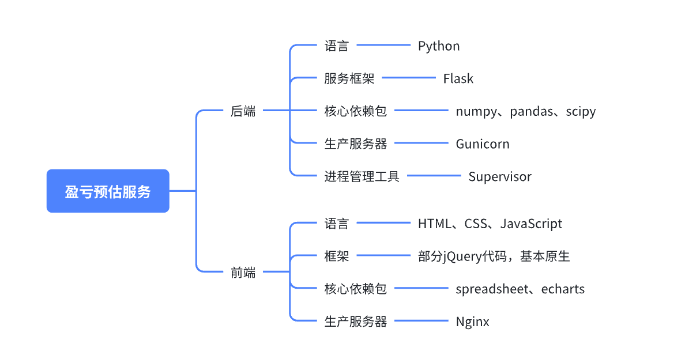

- 项目功能时序

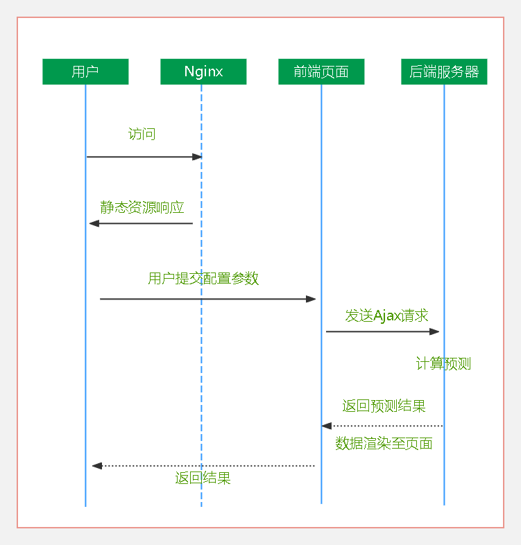

## 3.4开发环境搭建

> IDE主要使用vscode，环境直接基于Linux环境，模拟生产部署时的环境，避免线上线下不一致的问题，而Linux环境由Docker容器提供。
>
> 1）下载安装vscode
>
> [Visual Studio Code - Code Editing. Redefined](https://code.visualstudio.com/)
>
> 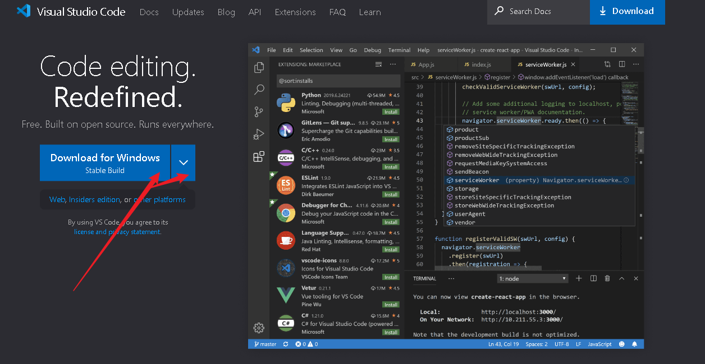
>
> 2）vscode配置
>
> 下载完成后，打开vscode，安装中文插件。
>
> 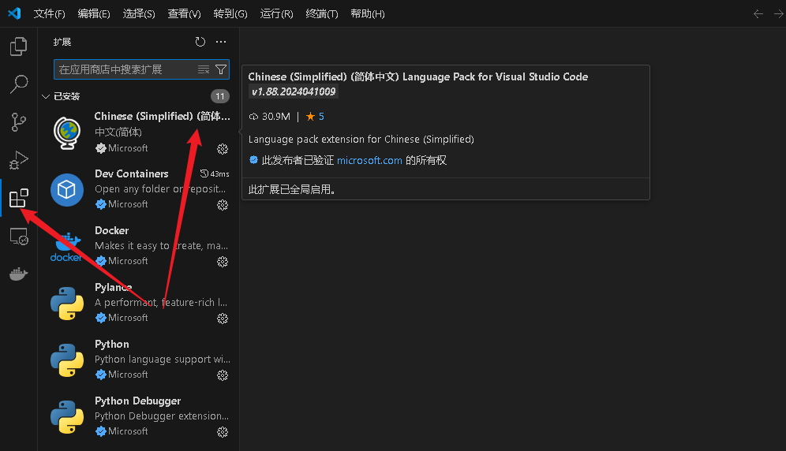
>
> 安装Docker插件，注意，这里是vscode的插件，并不是Docker本身。
>
> 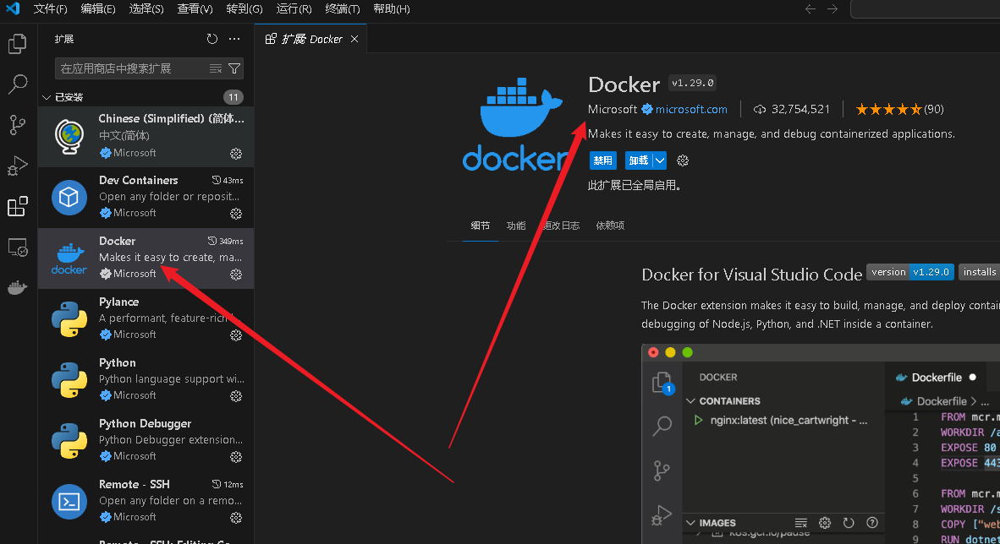
>
> 安装Remote-SSH插件，注意这个插件是为了连接远程服务器的，如果你不想购买服务器并进行部署，可以不需要安装。
>
> 
>
> 3）下载安装Docker
>
> [Docker Desktop: The #1 Containerization Tool for Developers | Docker](https://www.docker.com/products/docker-desktop/)
>
> 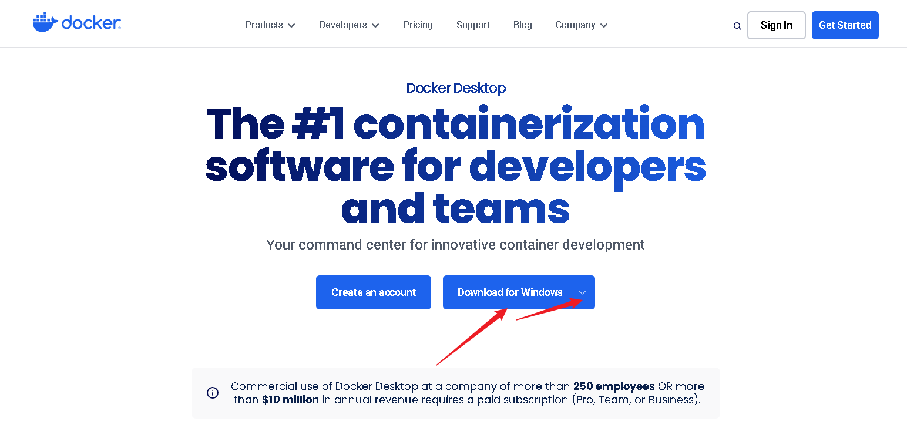
>
> 安装时一直点击下一步即可，尽量不要做任何自定义的配置。
>
> 4）检查Docker是否安装成功
>
> 按住键盘Win键和R键，输入cmd，点击确定，进入cmd命令行，输入如下命令并回车，显示当前安装的Docker版本，则说明安装成功。
>
> 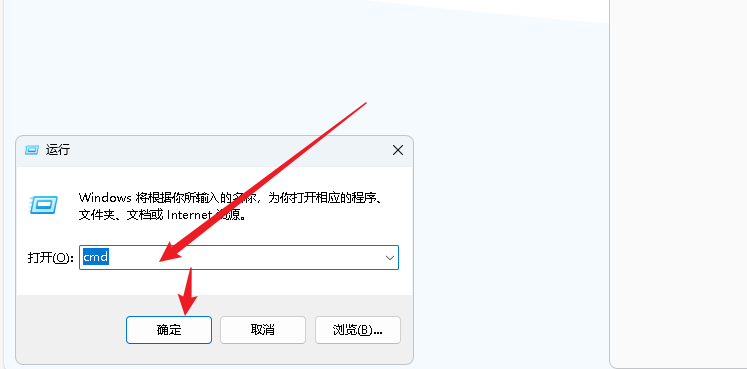
>
> ```cmd
> docker --version
> ```
>
> 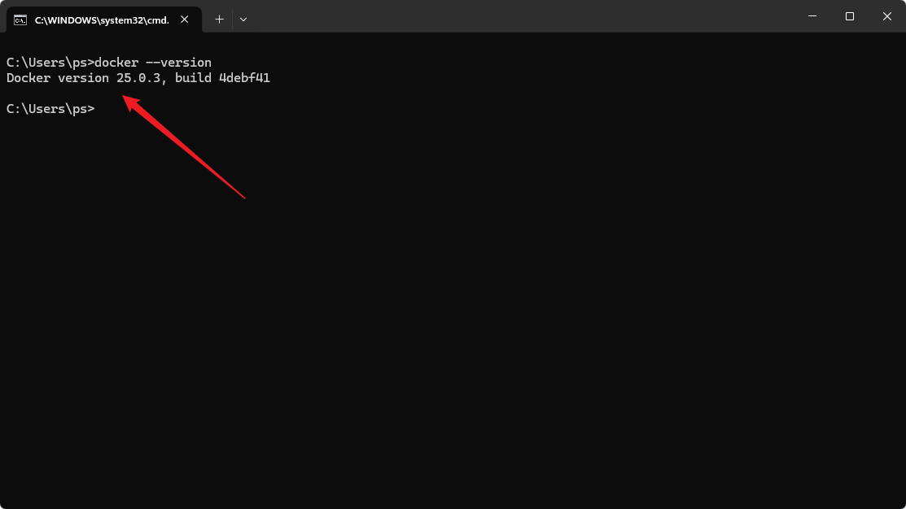
>
> 5）创建并配置Docker容器
>
> 在创建Docker容器前，我们要先做好规划，根据前面章节介绍过的项目技术路线，我们需要部署一个后端服务，还要部署一个前端服务，前端服务器使用的是Nginx，因为我们的项目比较小，这里作为示例就选择部署在一台机器上，但如果公司有统一的Nginx服务器，则可以分开部署，性能会更好一些。既然要部署两个服务，那么我们在创建并启动容器时，就需要开放两个端口，这样才能在本地来访问测试服务。
>
> 接下来创建并启动Docker容器，在命令行中输入如下命令创建命令：
>
> ```cmd
> docker run --name=profit_predict -p 5000:5000 -p 8888:8888 -itd ubuntu:22.04 /bin/bash
> ```
>
> 出现容器id，则说明创建成功。
>
> 
>
> 6）启动容器，进行容器环境配置
>
> 输入如下命令，进入容器：
>
> ```cmd
> docker exec -it d05c454cbae5 /bin/bash
> ```
>
> 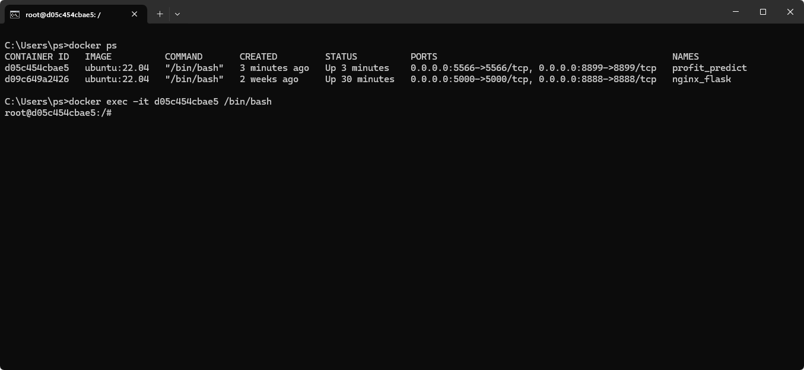
>
> 安装配置Python3.10及pip：
>
> ```shell
> # 以下命令如果非root用户，需要在前面补充sudo命令，如果是root用户，逐步执行即可
> # 更新apt
> apt update
> 
> # Ubuntu安装Python3.10
> apt install python3.10 -y
> 
> # 加软链接
> ln -s /usr/bin/python3.10 /usr/bin/python3
> 
> # 验证安装是否正确，进入Python命令行说明配置完成
> python3
> 
> # 安装pip
> apt install pip -y
> 
> # 安装virtualenv依赖包
> pip install virtualenv
> 
> # 构建虚拟环境
> cd ~
> virtualenv venv_profit_predict
> 
> # 激活虚拟环境
> source venv_profit_predict/bin/activate
> 
> # 创建代码目录
> cd ~
> mkdir code
> cd code
> ```
>
> 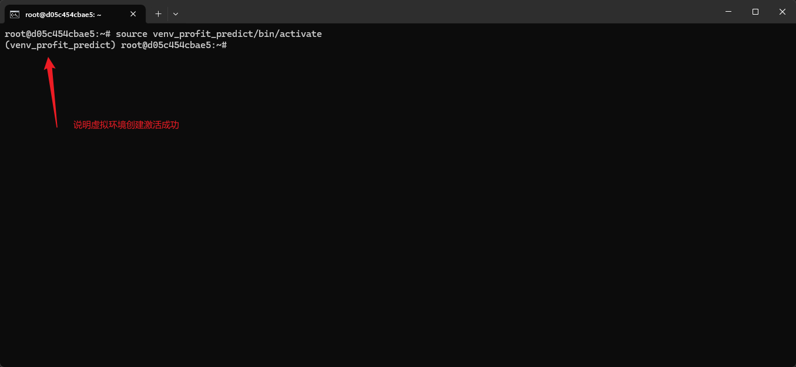
>
> 7）安装Nginx
>
> ```shell
> # 以下命令如果非root用户，需要在前面补充sudo命令
> apt install nginx -y
> 
> # 启动Nginx
> service nginx start
> 
> # 查看Nginx状态，如果显示running，则说明启动成功
> service nginx status
> ```
>
> 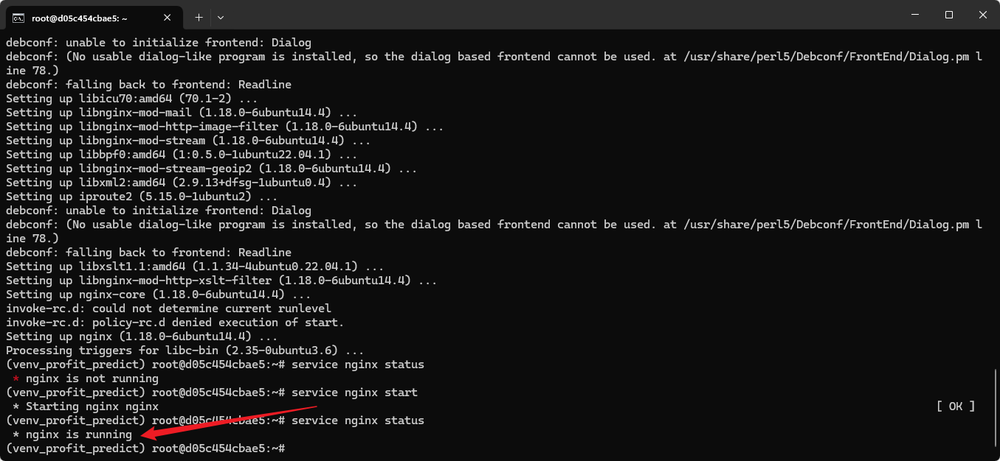
>
> 8）vscode连接Docker容器
>
> 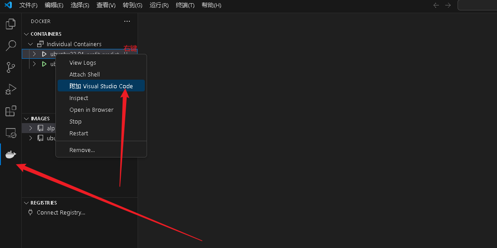
>
> 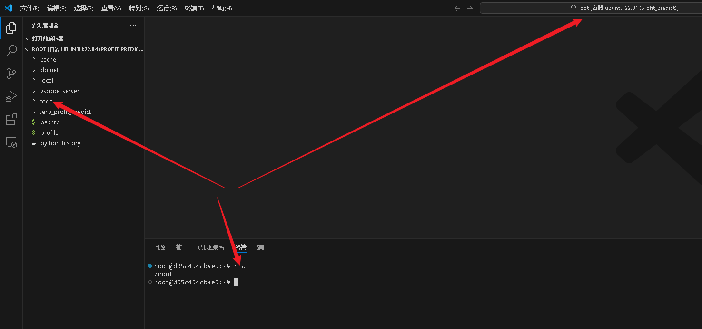
>
> ​	**至此，整个项目的开发环境已全部搭建完毕，接下来就可以快乐地coding了。**

## 3.5后端开发

- 框架搭建

> 基于Supervisor+Gunicorn+Flask搭建后端服务。

- 工具编写

> 计算拟合工具：幂函数拟合留存率、修正留存率拟合
>
> 异常处理工具
>
> 日志记录工具

- 首次提交配置预测视图函数编写

> 配置解析
>
> 时间区间展开
>
> 配置参数按时间区间展开
>
> 拟合留存率曲线
>
> 预测买量留存
>
> 处理历史买量
> 计算盈亏
> 结果返回

- 修订数据明细再次提交配置预测视图函数编写

> 配置解析
>
> 时间区间展开
>
> 拟合留存率曲线
>
> 预测买量留存
>
> 处理历史买量
> 计算盈亏
> 结果返回

## 3.6前端开发

- 页面基本框架搭建

> 基本配置页
>
> 历史买量配置页
>
> 预测阶段配置页
>
> 留存率配置页
>
> 首页

- 基础配置标签功能编写

> 页面刷新
>
> 配置重刷
>
> 配置提交

- 历史配置标签功能编写

> 页面刷新
>
> 配置年月展开
>
> 配置重刷
>
> 配置提交

- 时段配置标签功能编写

> 页面刷新
>
> 配置年月展开
>
> 配置重刷
>
> 配置提交

- 留存配置标签功能编写

> 页面刷新
>
> 配置重刷
>
> 留存率预测结果刷新
>
> 留存率预测结果导出
>
> 配置提交

- 分成配置标签功能编写

> 页面刷新
>
> 配置重刷
>
> 配置提交

- 数据明细标签功能编写

> 页面刷新
>
> 数据写入
>
> 重新预测

- 日度盈亏标签功能编写

> 页面刷新
>
> 数据写入

- 月度盈亏标签功能编写

> 页面刷新
>
> 数据写入

- 数据趋势标签功能编写

> 页面刷新
>
> Echarts图表渲染

- 请求预测功能编写

> 配置参数整理
>
> 发送Ajax

- 配置导入导出功能编写

> 配置导出
>
> 配置导入

## 3.7项目生产部署及验收


# 4.后记

## 4.1关于AI时代下的开发者的一些思考

- 程序员会失业吗？

> ​	在AI时代，程序员可能会面临一些变化，但失业并非必然结果。比如：
>
> ​	**自动化取代低级任务：** 随着AI和自动化技术的发展，一些传统的低级编程任务可能会被自动化取代，比如模板化的代码编写、测试和调试等。这可能会导致一部分程序员在这些领域的就业机会减少。
>
> ​	**需求转移：** 尽管某些任务可能被自动化，但AI的出现也会创造出新的领域和机会，需要程序员来开发、维护和优化AI系统。例如，机器学习工程师、数据科学家、自然语言处理工程师等新兴岗位的需求可能会增加。
>
> ​	**重要性提升：** 随着AI技术在社会和商业中的普及，编程技能的重要性可能会进一步提升。程序员可能需要不断学习和适应新技术，以满足市场需求。
>
> ​	**专业化需求增加：** 随着技术的发展，不同领域对特定编程技能的需求可能会增加。例如，医疗领域可能需要程序员来开发医疗信息系统，智能交通领域可能需要程序员来开发自动驾驶技术等。这意味着程序员可能需要更多的专业化知识。
>
> ​	**人机合作：** AI不仅可以取代人类的一些工作，还可以与人类合作来完成复杂的任务。在这种情况下，程序员可能会与AI系统一起工作，共同解决问题，而不是被完全取代。
>
> ​	总的来说，尽管AI技术的发展可能会对程序员的就业产生一些影响，但程序员依然会在未来发挥重要作用。关键在于不断学习、适应新技术，并且灵活应对市场需求的变化。
>
> ​	所以无论科学技术如何发展，我们自身不能止步不前，只要持续学习，就永远不会被时代所淘汰，但如果你固步自封，一直守着自己的一亩三分地，那早晚有一天你所舒适的区域会被颠覆。即便在未来的某一天，AGI实现了，难道就不需要有人了解对应的底层原理了吗？难道任由机器进行自我进化吗？我想答案一定是否定的，到了AGI时代，可能程序员的工作的主要内容不再是写代码，而更多的是参与到AGI的管理当中，而且我觉得新时代对应的程序员需求只会更多，只不过为了适应对应的新时代，我们程序员自身要符合新时代对程序员的要求。尤其作为已经是程序员的群体来说，了解学习新的计算机知识，肯定要比从零开始的人快得多，所以问题主要在于我们是否愿意持续的付出时间来学习。
>
> ​	当你再次遇到同样的问题，我觉得作为一个会思考的人来讲，更多的不是立即被带入到精心设计的焦虑中，而是思考自己是否有勇气再次突破自我，学习新的知识从而适应新时代！

- 非程序员群体有机会参与到软件创造中来吗？

> ​	虽然传统上软件开发主要由程序员完成，但随着技术的发展和工具的普及，非程序员也有了更多参与的机会，这主要归因于以下几个因素：
>
> ​	**低代码/无代码平台：** 这些平台使非程序员可以使用图形界面和预设模块来创建应用程序，而不需要编写代码。通过这些工具，人们可以快速地搭建应用程序，从而将软件开发的门槛降低到了一个更容易接受的水平。
>
> ​	**AI辅助开发工具：** AI技术正在被应用于开发过程中，例如自动代码生成、智能代码补全、错误检测和修复等。这些工具可以帮助非程序员更轻松地参与到软件开发中，即使他们没有深入的编程知识也能够做出贡献。
>
> ​	**领域专家的参与：** 在许多软件开发项目中，领域专家的知识和见解是至关重要的。非程序员群体通常具有特定领域的专业知识，他们可以与程序员合作，共同开发出更符合实际需求的软件产品。
>
> ​	**用户体验设计：** 用户体验设计对软件的成功至关重要，这不仅涉及到界面设计，还包括用户需求分析、用户反馈收集等方面。非程序员在这方面通常具有更多的经验和见解，可以为软件开发团队提供重要的指导和支持。
>
> ​	**测试和反馈：** 软件开发过程中的测试和反馈阶段也是非程序员可以参与的重要环节。他们可以帮助发现和报告软件中的问题，提出改进建议，从而改善软件的质量和用户体验。
>
> ​	综上所述，虽然软件开发过程中仍然需要程序员的专业知识和技能，但非程序员群体在AI时代也有更多的机会参与到软件创造中来，他们可以通过各种方式为软件开发团队带来独特的价值和贡献。
>
> ​	所以，即使你不是一个程序员，当前这门项目课，你也完全可以学完掌握，比如在补充了必要的基本知识后，完全可以边听老师的课边理解知识点，不懂的点可以让大模型来帮你解答，你甚至可以让大模型将整个项目的代码都读一遍，然后逐一的给你解释对应的知识点，这样的学习效率要远比传统的学习方式高效的多。
>
> 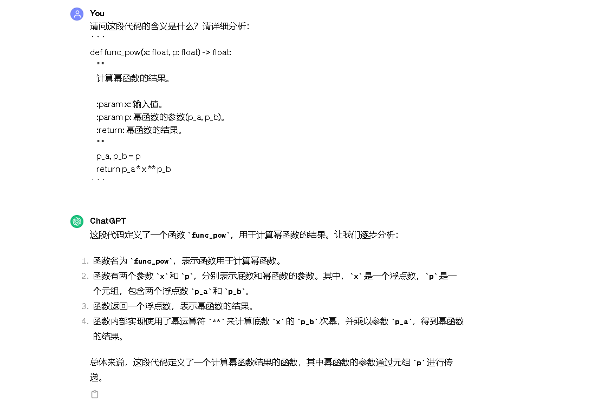

## 4.2后续课程规划

> ​	后续为大家带来的所有的课程，都会保证是生产上可以直接应用的项目课，再者保证这些项目都有真实的生产场景。课程内容以及讲解方式会根据本门课程大家的反馈，来逐步调整。
>
> ​	可能的方向有：
>
> ​	基于大模型构建智能助手，构建一个全流程的价格预测类算法项目等。当然，大家有什么好的想法或者想要学习的方向，也可以私信老师，也可以大家进行共创，比如你当前的工作场景中有些需要通过算法手段解决的，总之形式是多样的，唯一的宗旨就是让大家学到知识，学到有用的知识。

